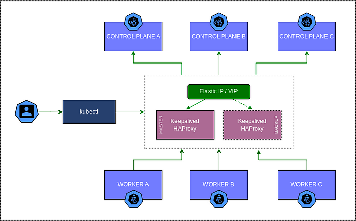

# Cluster Kubernetes HA (Alta Disponibilidade)



## Sumário

1. [Introdução](#introdução)
2. [Arquitetura do Cluster](#arquitetura-do-cluster)
3. [Pré-requisitos](#pré-requisitos)
4. [Instalação do Cluster Kubernetes HA](#instalação-do-cluster-kubernetes-ha)
   - [Configuração Inicial dos Nós](#configuração-inicial-dos-nós)
   - [Configuração do Load Balancer (HAProxy + Keepalived)](#configuração-do-load-balancer-haproxy--keepalived)
   - [Inicialização do Cluster Kubernetes](#inicialização-do-cluster-kubernetes)
   - [Configuração de Rede no Cluster](#configuração-de-rede-no-cluster)
5. [Implementação do Nginx Gateway Fabric](#implementação-do-nginx-gateway-fabric)
   - [Instalação do Nginx Gateway Fabric](#instalação-do-nginx-gateway-fabric)
   - [Configuração do Gateway API](#configuração-do-gateway-api)
   - [Configuração de Redirecionamento HTTP para HTTPS](#configuração-de-redirecionamento-http-para-https)
6. [Implementação do Rook Ceph](#implementação-do-rook-ceph)
   - [Instalação do Rook Operator](#instalação-do-rook-operator)
   - [Configuração do Cluster Ceph](#configuração-do-cluster-ceph)
   - [Criação de Storage Classes e Pools](#criação-de-storage-classes-e-pools)
7. [Implementação do MinIO](#implementação-do-minio)
   - [Instalação do MinIO Operator](#instalação-do-minio-operator)
   - [Configuração do MinIO Tenant](#configuração-do-minio-tenant)
   - [Configuração de Acesso via Gateway API](#configuração-de-acesso-via-gateway-api)
8. [Troubleshooting](#troubleshooting)
   - [Problemas Comuns do Cluster Kubernetes](#problemas-comuns-do-cluster-kubernetes)
   - [Problemas com HAProxy/Keepalived](#problemas-com-haproxykeepalived)
   - [Problemas com Nginx Gateway Fabric](#problemas-com-nginx-gateway-fabric)
   - [Problemas com Rook Ceph](#problemas-com-rook-ceph)
   - [Problemas com MinIO](#problemas-com-minio)
9. [Manutenção](#manutenção)
   - [Backup e Restauração](#backup-e-restauração)
   - [Atualizações do Cluster](#atualizações-do-cluster)
   - [Monitoramento e Logging](#monitoramento-e-logging)
10. [Referências](#referências)

## Introdução

Este repositório contém a documentação completa para a implementação de um cluster Kubernetes em Alta Disponibilidade (HA) com 3 nós master (Control Plane) e 3 nós workers. O cluster utiliza HAProxy com Keepalived para balanceamento de carga e redundância, Nginx Gateway Fabric como ingress controller, Rook Ceph como solução de armazenamento distribuído e MinIO como serviço de armazenamento de objetos compatível com S3.

A documentação é destinada a profissionais DevOps responsáveis pela implementação e manutenção de infraestrutura Kubernetes em ambientes bare metal.

## Arquitetura do Cluster

### Componentes Principais

- **Nós Master (Control Plane)**: 3 nós responsáveis por gerenciar o cluster, executando os componentes: API Server, Controller Manager, Scheduler e etcd.
- **Nós Workers**: 3 nós que executam as cargas de trabalho (pods).
- **Balanceador de Carga**: HAProxy + Keepalived para distribuir o tráfego entre os nós master e fornecer um IP virtual (VIP) para acesso ao cluster.
- **Banco de Dados Distribuído**: etcd configurado em modo distribuído nos nós master.
- **Ingress Controller**: Nginx Gateway Fabric para gerenciar o tráfego de entrada para os serviços do cluster.
- **Storage**: Rook Ceph para armazenamento distribuído e MinIO para armazenamento de objetos compatível com S3.

### Topologia

A arquitetura do cluster segue o seguinte design:

1. **Camada de Acesso**:
   - Usuários acessam o cluster através do kubecli, que se comunica com o Load Balancer.
   - O Load Balancer (HAProxy + Keepalived) distribui o tráfego entre os nós master.

2. **Camada de Controle**:
   - 3 nós master (Control Plane A, B e C) executam os componentes de controle do Kubernetes.
   - O etcd é distribuído entre os nós master para alta disponibilidade.

3. **Camada de Trabalho**:
   - 3 nós workers (Worker A, B e C) executam as cargas de trabalho do cluster.
   - Os workers se comunicam com os masters através do Load Balancer.

4. **Camada de Armazenamento**:
   - Rook Ceph fornece armazenamento distribuído para o cluster.
   - MinIO fornece armazenamento de objetos compatível com S3.

## Pré-requisitos

### Infraestrutura

- **8 servidores/VMs**:
  - 3 para os nós master
  - 3 para os nós workers
  - 2 para o Load Balancer (HAProxy + Keepalived)

- **Requisitos de Hardware**:
  - **Masters**: 4 CPUs, 8 GB RAM, 50 GB disco
  - **Workers**: 2 CPUs, 4 GB RAM, 50 GB disco
  - **LB**: 2 CPUs, 4 GB RAM, 50 GB disco

- **Sistema Operacional**:
  - Ubuntu 20.04/22.04 LTS ou CentOS 7/8

- **Rede**:
  - Conectividade de rede estável entre todos os nós
  - Endereços IP estáticos para todos os nós

### Ferramentas

- **Container Runtime**: containerd
- **kubeadm**: Ferramenta oficial para criar clusters Kubernetes
- **kubectl**: CLI para interagir com o cluster
- **HAProxy + Keepalived**: Para balanceamento de carga e IP virtual (VIP)

## Instalação do Cluster Kubernetes HA

### Configuração Inicial dos Nós

Execute os seguintes passos em todos os nós (master e worker):

1. **Atualizar o Sistema Operacional**:

```bash
sudo apt update && sudo apt upgrade -y
```

2. **Instalar o Container Runtime (CRI-O)**:

```bash
OBS: Note que devemos substituir as variáveis $KUBERNETES_VERSION e $CRIO_VERSION por v1.30 e v1.30 respectivamente. Isso pode ser feito de duas formas, a primeira exportando as variáveis com as diretivas export KUBERNETES_VERSION='v1.30'; export CRIO_VERSION='v1.30'

adiciona repositório nas listas de pacotes e adiciona as chaves
curl -fsSL https://pkgs.k8s.io/addons:/cri-o:/stable:/$CRIO_VERSION/deb/Release.key | gpg --dearmor -o /etc/apt/keyrings/cri-o-apt-keyring.gpg
echo "deb [signed-by=/etc/apt/keyrings/cri-o-apt-keyring.gpg] https://pkgs.k8s.io/addons:/cri-o:/stable:/$CRIO_VERSION/deb/ /" | tee /etc/apt/sources.list.d/cri-o.list

atualiza a lista de pacotes e instala o cri-o
apt-get update
apt-get install cri-o

Instalação do kubeadm, kubelet and kubectl
Agora que eu tenho o container runtime instalado em todas as máquinas, chegou a hora de instalar o kubeadm, o kubelet e o kubectl. Então vamos seguir as etapas e executar esses passos em TODAS AS MÁQUINAS.

Atualizo os pacotes necessários pra instalação
sudo apt-get update && \
sudo apt-get install -y apt-transport-https ca-certificates curl

Download da chave pública
If the directory /etc/apt/keyrings does not exist, it should be created before the curl command, read the note below.
sudo mkdir -p -m 755 /etc/apt/keyrings

curl -fsSL https://pkgs.k8s.io/core:/stable:/$KUBERNETES_VERSION/deb/Release.key | gpg --dearmor -o /etc/apt/keyrings/kubernetes-apt-keyring.gpg
echo "deb [signed-by=/etc/apt/keyrings/kubernetes-apt-keyring.gpg] https://pkgs.k8s.io/core:/stable:/$KUBERNETES_VERSION/deb/ /" | tee /etc/apt/sources.list.d/kubernetes.list

Atualização do repositório apt e instalação das ferramentas
sudo apt-get update && \
sudo apt-get install -y kubelet kubeadm kubectl

Agora eu garanto que eles não sejam atualizados automaticamente.
sudo apt-mark hold kubelet kubeadm kubectl
```

3. **Desativar Swap**:

```bash
sudo swapoff -a
sudo sed -i '/swap/d' /etc/fstab
```

4. **Configurar Kernel Modules**:

```bash
cat <<EOF | sudo tee /etc/modules-load.d/k8s.conf
overlay
br_netfilter
EOF

sudo modprobe overlay
sudo modprobe br_netfilter

cat <<EOF | sudo tee /etc/sysctl.d/k8s.conf
net.bridge.bridge-nf-call-iptables  = 1
net.ipv4.ip_forward                 = 1
net.bridge.bridge-nf-call-ip6tables = 1
EOF

sudo sysctl --system
```

5. **Instalar kubeadm, kubelet e kubectl**:

```bash
sudo apt update
sudo apt install -y apt-transport-https curl
curl -s https://packages.cloud.google.com/apt/doc/apt-key.gpg | sudo apt-key add -
echo "deb https://apt.kubernetes.io/ kubernetes-xenial main" | sudo tee /etc/apt/sources.list.d/kubernetes.list
sudo apt update
sudo apt install -y kubelet kubeadm kubectl
sudo apt-mark hold kubelet kubeadm kubectl
```

### Configuração do Load Balancer (HAProxy + Keepalived)

Execute os seguintes passos nos servidores dedicados ao Load Balancer:

1. **Instalar HAProxy e Keepalived**:

```bash
sudo apt install -y haproxy keepalived
```

2. **Configurar HAProxy** (`/etc/haproxy/haproxy.cfg`):

```
frontend kubernetes
    bind <VIP>:6443
    mode tcp
    option tcplog
    default_backend kubernetes-masters

backend kubernetes-masters
    mode tcp
    balance roundrobin
    server master1 <IP_MASTER1>:6443 check
    server master2 <IP_MASTER2>:6443 check
    server master3 <IP_MASTER3>:6443 check
```

Substitua `<VIP>` pelo endereço IP virtual que será usado para acessar o cluster e `<IP_MASTER1>`, `<IP_MASTER2>` e `<IP_MASTER3>` pelos endereços IP dos nós master.

3. **Configurar Keepalived** (`/etc/keepalived/keepalived.conf`):

No servidor primário:

```
vrrp_instance VI_1 {
    state MASTER
    interface eth0
    virtual_router_id 51
    priority 100
    advert_int 1
    authentication {
        auth_type PASS
        auth_pass 1234
    }
    virtual_ipaddress {
        <VIP>
    }
}
```

No servidor secundário:

```
vrrp_instance VI_1 {
    state BACKUP
    interface eth0
    virtual_router_id 51
    priority 90
    advert_int 1
    authentication {
        auth_type PASS
        auth_pass 1234
    }
    virtual_ipaddress {
        <VIP>
    }
}
```

Substitua `<VIP>` pelo endereço IP virtual e `eth0` pela interface de rede correta.

4. **Reiniciar os Serviços**:

```bash
sudo systemctl restart haproxy
sudo systemctl restart keepalived
```

### Inicialização do Cluster Kubernetes

1. **Inicializar o Primeiro Nó Master**:

```bash
sudo kubeadm init --control-plane-endpoint "k8s.sie.net:6443" \
--upload-certs \
--pod-network-cidr=192.168.0.0/16
```

Substitua `k8s.sie.net` pelo nome DNS ou IP virtual do Load Balancer.

2. **Configurar o kubectl para o Usuário Regular**:

```bash
mkdir -p $HOME/.kube
sudo cp -i /etc/kubernetes/admin.conf $HOME/.kube/config
sudo chown $(id -u):$(id -g) $HOME/.kube/config
```

3. **Adicionar Outros Nós Master**:

Use o comando gerado pelo primeiro nó master para adicionar os outros dois nós master:

```bash
sudo kubeadm join k8s.sie.net:6443 --token <TOKEN> \
--discovery-token-ca-cert-hash sha256:<HASH> \
--control-plane --certificate-key <CERT_KEY>
```

4. **Adicionar Nós Workers**:

Use o comando simplificado para adicionar os nós workers:

```bash
sudo kubeadm join k8s.sie.net:6443 --token <TOKEN> \
--discovery-token-ca-cert-hash sha256:<HASH>
```

### Configuração de Rede no Cluster

1. **Instalar o Plugin de Rede Calico**:

```bash
kubectl apply -f https://raw.githubusercontent.com/projectcalico/calico/v3.25.0/manifests/calico.yaml
```

2. **Verificar o Status do Cluster**:

```bash
kubectl get nodes
kubectl get pods --all-namespaces
```

## Implementação do Nginx Gateway Fabric

O Nginx Gateway Fabric é utilizado como ingress controller para gerenciar o tráfego de entrada para os serviços do cluster.

### Instalação do Nginx Gateway Fabric

1. **Criar o Namespace para o Nginx Gateway Fabric**:

```bash
kubectl apply -f yamls/nginx-gateway-fabric/infra-ns.yaml
```

2. **Implantar o Nginx Gateway Fabric**:

```bash
kubectl apply -f yamls/nginx-gateway-fabric/deploy-gateway-fabric.yaml
```

3. **Configurar o Serviço do Gateway**:

```bash
kubectl apply -f yamls/nginx-gateway-fabric/gateway-service.yaml
```

### Configuração do Gateway API

1. **Criar o Gateway**:

```bash
kubectl apply -f yamls/nginx-gateway-fabric/gateway.yaml
```

O arquivo `gateway.yaml` define múltiplos listeners para diferentes serviços, incluindo:
- HTTP e HTTPS para Ceph
- HTTP e HTTPS para Ceph S3
- HTTP e HTTPS para MinIO (front e back)

### Configuração de Redirecionamento HTTP para HTTPS

1. **Configurar o Redirecionamento HTTP para HTTPS**:

```bash
kubectl apply -f yamls/nginx-gateway-fabric/http-to-https-redirect.yaml
```

Este arquivo configura um HTTPRoute que redireciona todo o tráfego HTTP para HTTPS com o código de status 301.

## Implementação do Rook Ceph

O Rook Ceph é utilizado como solução de armazenamento distribuído para o cluster Kubernetes.

### Instalação do Rook Operator

1. **Clonar o Repositório do Rook**:

```bash
git clone --single-branch --branch v1.11.0 https://github.com/rook/rook.git
cd rook/deploy/examples
```

2. **Aplicar os Manifestos do Rook Operator**:

```bash
kubectl create -f crds.yaml
kubectl create -f common.yaml
kubectl create -f operator.yaml
```

3. **Verificar o Status do Rook Operator**:

```bash
kubectl -n rook-ceph get pods
```

### Configuração do Cluster Ceph

1. **Criar o Arquivo de Configuração do Cluster Ceph**:

```yaml
apiVersion: ceph.rook.io/v1
kind: CephCluster
metadata:
  name: rook-ceph
  namespace: rook-ceph
spec:
  cephVersion:
    image: quay.io/ceph/ceph:v17.2.5
    allowUnsupported: false
  dataDirHostPath: /var/lib/rook
  mon:
    count: 3
    allowMultiplePerNode: false
  mgr:
    modules:
      - name: pg_autoscaler
        enabled: true
  storage:
    useAllNodes: false
    useAllDevices: false
    deviceFilter: "^sd[b-z]"
    config:
      osdsPerDevice: "1"
      storeType: bluestore
    nodes:
    - name: "k8s-2"
      devices:
        - name: "sdb"
          config:
            storageType: bluestore
            osdsPerDevice: "1"
    - name: "k8s-3"
      devices:
        - name: "sdb"
          config:
            storageType: bluestore
            osdsPerDevice: "1"
    - name: "k8s-4"
      devices:
        - name: "sdb"
          config:
            storageType: bluestore
            osdsPerDevice: "1"
```

2. **Aplicar o Cluster Ceph**:

```bash
kubectl create -f cluster.yaml
```

3. **Verificar o Status do Cluster Ceph**:

```bash
kubectl -n rook-ceph get pods
kubectl -n rook-ceph get cephclusters
```

### Criação de Storage Classes e Pools

1. **Criar um Pool Ceph para Armazenamento em Bloco**:

```yaml
apiVersion: ceph.rook.io/v1
kind: CephBlockPool
metadata:
  name: replicapool
  namespace: rook-ceph
spec:
  failureDomain: host
  replicated:
    size: 3
  parameters:
    compression_mode: none
```

2. **Criar uma StorageClass**:

```yaml
apiVersion: storage.k8s.io/v1
kind: StorageClass
metadata:
  name: rook-ceph-block
provisioner: rook-ceph.rbd.csi.ceph.com
parameters:
  clusterID: rook-ceph
  pool: replicapool
  imageFormat: "2"
  imageFeatures: layering
  csi.storage.k8s.io/provisioner-secret-name: rook-csi-rbd-provisioner
  csi.storage.k8s.io/provisioner-secret-namespace: rook-ceph
  csi.storage.k8s.io/controller-expand-secret-name: rook-csi-rbd-provisioner
  csi.storage.k8s.io/controller-expand-secret-namespace: rook-ceph
  csi.storage.k8s.io/node-stage-secret-name: rook-csi-rbd-node
  csi.storage.k8s.io/node-stage-secret-namespace: rook-ceph
reclaimPolicy: Delete
allowVolumeExpansion: true
mountOptions: []
```

3. **Definir a StorageClass como Padrão** (opcional):

```bash
kubectl patch storageclass rook-ceph-block -p '{"metadata": {"annotations":{"storageclass.kubernetes.io/is-default-class":"true"}}}'
```

## Implementação do MinIO

O MinIO é utilizado como serviço de armazenamento de objetos compatível com S3.

### Instalação do MinIO Operator

1. **Adicionar o Repositório Helm do MinIO**:

```bash
helm repo add minio https://operator.min.io/
helm repo update
```

2. **Instalar o MinIO Operator**:

```bash
kubectl create namespace minio-operator
helm install --namespace minio-operator --create-namespace minio-operator minio/operator
```

3. **Verificar o Status do MinIO Operator**:

```bash
kubectl get pods -n minio-operator
```

### Configuração do MinIO Tenant

1. **Criar o Namespace para o MinIO Tenant**:

```bash
kubectl create namespace integra-glpi-ns
kubectl label namespace integra-glpi-ns shared-gateway-access=true
```

2. **Criar os Secrets para o MinIO Tenant**:

```bash
kubectl apply -f yamls/minio/secret-minio_tanant.yaml
```

3. **Implantar o MinIO Tenant**:

```bash
kubectl apply -f yamls/minio/minio-tanant-deploy.yaml
```

O arquivo `minio-tanant-deploy.yaml` configura um tenant MinIO com as seguintes características:
- 4 servidores com 1 volume por servidor
- 11Gi de armazenamento por volume
- Configuração para acesso via URLs personalizadas (minioback.deinfra.sc.gov.br e miniofront.deinfra.sc.gov.br)

4. **Verificar o Status do MinIO Tenant**:

```bash
kubectl get pods -n integra-glpi-ns
```

### Configuração de Acesso via Gateway API

1. **Criar os Certificados para o MinIO**:

```bash
kubectl apply -f yamls/minio/certificate-minio-back.yaml
kubectl apply -f yamls/minio/certificate-minio-front.yaml
```

2. **Configurar as Rotas HTTP para o MinIO**:

```bash
kubectl apply -f yamls/minio/http_route-minioback.yaml
kubectl apply -f yamls/minio/http_route-miniofront.yaml
```

Os arquivos de rota HTTP configuram o acesso ao backend do MinIO (API S3) e ao frontend do MinIO (Console).

## Troubleshooting

### Problemas Comuns do Cluster Kubernetes

#### Nós não estão prontos (NotReady)

**Sintoma**: Nós aparecem como `NotReady` ao executar `kubectl get nodes`.

**Solução**:
1. Verificar o status do kubelet:
   ```bash
   sudo systemctl status kubelet
   ```

2. Verificar os logs do kubelet:
   ```bash
   sudo journalctl -u kubelet
   ```

3. Verificar a conectividade de rede entre os nós:
   ```bash
   ping <IP_DO_NO>
   ```

#### Pods em estado pendente (Pending)

**Sintoma**: Pods permanecem no estado `Pending`.

**Solução**:
1. Verificar eventos do pod:
   ```bash
   kubectl describe pod <NOME_DO_POD>
   ```

2. Verificar recursos disponíveis nos nós:
   ```bash
   kubectl describe nodes
   ```

#### Falha na inicialização do cluster

**Sintoma**: O comando `kubeadm init` falha.

**Solução**:
1. Verificar os logs do kubeadm:
   ```bash
   sudo kubeadm init --v=5 --control-plane-endpoint "k8s.sie.net:6443" --upload-certs --pod-network-cidr=192.168.0.0/16
   ```

2. Resetar o kubeadm:
   ```bash
   sudo kubeadm reset
   ```

3. Verificar a conectividade com o Load Balancer:
   ```bash
   curl -k https://k8s.sie.net:6443
   ```

### Problemas com HAProxy/Keepalived

#### IP Virtual não está acessível

**Sintoma**: Não é possível acessar o IP virtual.

**Solução**:
1. Verificar o status do Keepalived:
   ```bash
   sudo systemctl status keepalived
   ```

2. Verificar os logs do Keepalived:
   ```bash
   sudo journalctl -u keepalived
   ```

3. Verificar se o IP virtual está atribuído a uma interface:
   ```bash
   ip addr show
   ```

#### HAProxy não está encaminhando tráfego

**Sintoma**: O HAProxy não está encaminhando tráfego para os nós master.

**Solução**:
1. Verificar o status do HAProxy:
   ```bash
   sudo systemctl status haproxy
   ```

2. Verificar os logs do HAProxy:
   ```bash
   sudo journalctl -u haproxy
   ```

3. Verificar a configuração do HAProxy:
   ```bash
   sudo haproxy -c -f /etc/haproxy/haproxy.cfg
   ```

### Problemas com Nginx Gateway Fabric

#### Gateway não está funcionando

**Sintoma**: Os serviços não estão acessíveis através do Gateway.

**Solução**:
1. Verificar o status do Gateway:
   ```bash
   kubectl get gateway -n infra-ns
   ```

2. Verificar o status do HTTPRoute:
   ```bash
   kubectl get httproute -A
   ```

3. Verificar os logs do Nginx Gateway Fabric:
   ```bash
   kubectl logs -n nginx-gateway deployment/nginx-gateway -c nginx-gateway
   ```

#### Certificados TLS não estão funcionando

**Sintoma**: Erros de certificado ao acessar serviços via HTTPS.

**Solução**:
1. Verificar o status dos certificados:
   ```bash
   kubectl get certificates -n infra-ns
   ```

2. Verificar o status dos secrets TLS:
   ```bash
   kubectl get secrets -n infra-ns | grep tls
   ```

3. Verificar os logs do cert-manager:
   ```bash
   kubectl logs -n cert-manager deployment/cert-manager
   ```

### Problemas com Rook Ceph

#### OSDs não estão inicializando

**Sintoma**: Os OSDs não estão inicializando ou estão em estado de erro.

**Solução**:
1. Verificar o status dos OSDs:
   ```bash
   kubectl -n rook-ceph get pods | grep osd
   ```

2. Verificar os logs dos OSDs:
   ```bash
   kubectl -n rook-ceph logs <OSD_POD_NAME>
   ```

3. Verificar o status do cluster Ceph:
   ```bash
   kubectl -n rook-ceph exec -it <TOOLS_POD_NAME> -- ceph status
   ```

#### PVCs em estado pendente

**Sintoma**: PVCs permanecem no estado `Pending`.

**Solução**:
1. Verificar o status das PVCs:
   ```bash
   kubectl get pvc
   ```

2. Verificar eventos das PVCs:
   ```bash
   kubectl describe pvc <PVC_NAME>
   ```

3. Verificar o status das StorageClasses:
   ```bash
   kubectl get sc
   ```

### Problemas com MinIO

#### Tenant não está inicializando

**Sintoma**: Os pods do MinIO Tenant não estão inicializando.

**Solução**:
1. Verificar o status dos pods do MinIO:
   ```bash
   kubectl get pods -n integra-glpi-ns
   ```

2. Verificar os logs dos pods do MinIO:
   ```bash
   kubectl logs -n integra-glpi-ns <MINIO_POD_NAME>
   ```

3. Verificar o status do MinIO Tenant:
   ```bash
   kubectl get tenant -n integra-glpi-ns
   ```

#### MinIO não está acessível via Gateway

**Sintoma**: Não é possível acessar o MinIO através dos URLs configurados.

**Solução**:
1. Verificar o status das rotas HTTP:
   ```bash
   kubectl get httproute -n integra-glpi-ns
   ```

2. Verificar o status dos serviços do MinIO:
   ```bash
   kubectl get svc -n integra-glpi-ns
   ```

3. Verificar os logs do Nginx Gateway Fabric:
   ```bash
   kubectl logs -n nginx-gateway deployment/nginx-gateway -c nginx-gateway
   ```

## Manutenção

### Backup e Restauração

#### Backup do etcd

O etcd é o componente mais crítico do cluster Kubernetes, pois armazena todo o estado do cluster. É essencial realizar backups regulares do etcd.

1. **Backup do etcd**:

```bash
sudo ETCDCTL_API=3 etcdctl --endpoints=https://127.0.0.1:2379 \
--cacert=/etc/kubernetes/pki/etcd/ca.crt \
--cert=/etc/kubernetes/pki/etcd/server.crt \
--key=/etc/kubernetes/pki/etcd/server.key \
snapshot save /path/to/backup/etcd-snapshot-$(date +%Y-%m-%d-%H-%M-%S).db
```

2. **Restauração do etcd**:

```bash
sudo ETCDCTL_API=3 etcdctl --endpoints=https://127.0.0.1:2379 \
--cacert=/etc/kubernetes/pki/etcd/ca.crt \
--cert=/etc/kubernetes/pki/etcd/server.crt \
--key=/etc/kubernetes/pki/etcd/server.key \
snapshot restore /path/to/backup/etcd-snapshot.db
```

#### Backup do Rook Ceph

1. **Backup dos Dados do Ceph**:

O Rook Ceph fornece mecanismos para backup e restauração de dados. Consulte a [documentação oficial do Rook](https://rook.io/docs/rook/v1.11/Storage-Configuration/Ceph-CSI/ceph-csi-snapshot/) para mais detalhes.

#### Backup do MinIO

1. **Backup dos Dados do MinIO**:

O MinIO fornece ferramentas como o `mc` (MinIO Client) para realizar backups. Consulte a [documentação oficial do MinIO](https://min.io/docs/minio/linux/reference/minio-mc.html) para mais detalhes.

### Atualizações do Cluster

#### Atualização do Kubernetes

1. **Atualizar o kubeadm**:

```bash
sudo apt-mark unhold kubeadm
sudo apt update
sudo apt install -y kubeadm=<VERSAO>
sudo apt-mark hold kubeadm
```

2. **Verificar o Plano de Atualização**:

```bash
sudo kubeadm upgrade plan
```

3. **Aplicar a Atualização no Primeiro Nó Master**:

```bash
sudo kubeadm upgrade apply v<VERSAO>
```

4. **Atualizar o kubelet e kubectl**:

```bash
sudo apt-mark unhold kubelet kubectl
sudo apt update
sudo apt install -y kubelet=<VERSAO> kubectl=<VERSAO>
sudo apt-mark hold kubelet kubectl
sudo systemctl daemon-reload
sudo systemctl restart kubelet
```

5. **Atualizar os Outros Nós Master**:

```bash
sudo kubeadm upgrade node
```

6. **Atualizar os Nós Workers**:

```bash
sudo apt-mark unhold kubeadm kubelet kubectl
sudo apt update
sudo apt install -y kubeadm=<VERSAO> kubelet=<VERSAO> kubectl=<VERSAO>
sudo apt-mark hold kubeadm kubelet kubectl
sudo kubeadm upgrade node
sudo systemctl daemon-reload
sudo systemctl restart kubelet
```

#### Atualização do Nginx Gateway Fabric

1. **Atualizar o Nginx Gateway Fabric**:

```bash
kubectl apply -f <NOVA_VERSAO_YAML>
```

#### Atualização do Rook Ceph

1. **Atualizar o Rook Operator**:

```bash
kubectl apply -f <NOVA_VERSAO_YAML>
```

2. **Atualizar o Cluster Ceph**:

```bash
kubectl apply -f <NOVA_VERSAO_YAML>
```

#### Atualização do MinIO

1. **Atualizar o MinIO Operator**:

```bash
helm upgrade --namespace minio-operator minio-operator minio/operator
```

2. **Atualizar o MinIO Tenant**:

```bash
kubectl apply -f <NOVA_VERSAO_YAML>
```

### Monitoramento e Logging

#### Prometheus e Grafana

1. **Instalar o Prometheus Operator**:

```bash
helm repo add prometheus-community https://prometheus-community.github.io/helm-charts
helm repo update
helm install prometheus prometheus-community/kube-prometheus-stack --namespace monitoring --create-namespace
```

2. **Acessar o Grafana**:

```bash
kubectl port-forward -n monitoring svc/prometheus-grafana 3000:80
```

#### Elasticsearch, Fluentd e Kibana (EFK)

1. **Instalar o EFK Stack**:

```bash
helm repo add elastic https://helm.elastic.co
helm repo update
helm install elasticsearch elastic/elasticsearch --namespace logging --create-namespace
helm install kibana elastic/kibana --namespace logging --create-namespace
kubectl apply -f fluentd-daemonset.yaml
```

2. **Acessar o Kibana**:

```bash
kubectl port-forward -n logging svc/kibana-kibana 5601:5601
```

## Referências

- [Documentação oficial do Kubernetes](https://kubernetes.io/docs/)
- [Documentação do kubeadm](https://kubernetes.io/docs/setup/production-environment/tools/kubeadm/)
- [Documentação do HAProxy](http://www.haproxy.org/#docs)
- [Documentação do Keepalived](https://www.keepalived.org/manpage.html)
- [Documentação do Nginx Gateway Fabric](https://github.com/nginxinc/nginx-gateway-fabric)
- [Documentação do Rook Ceph](https://rook.io/docs/rook/v1.11/)
- [Documentação do MinIO](https://min.io/docs/minio/kubernetes/upstream/)
